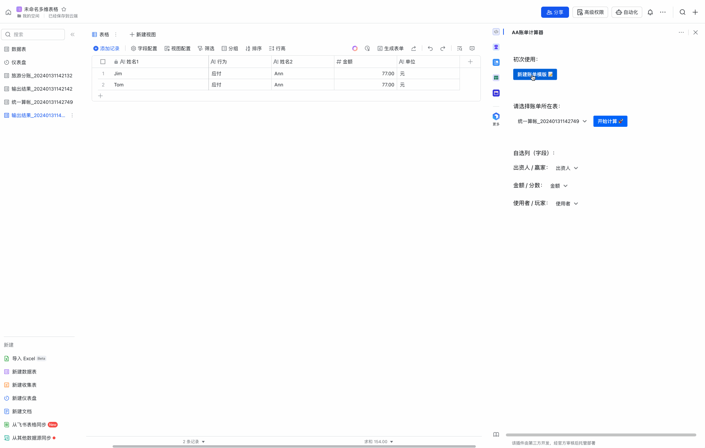

# AA账单计算器（Bill） - 飞书多维表格-简易AA分账插件

## 简介

`AA账单计算器`，开发代号：bill， 是一个为飞书多维表格设计的插件，可以为您生成用于记账的账单表格，并且可以通过表格数据为您计算出AA应付款项。bill可以帮助您轻松地处理多人消费事后分账、一人先付事后算帐、以及娱乐活动（如打麻将）中的分数往来计算。

## 功能特点

- **生成模版**：快速生成一个方便您用于记录消费事项的账单。
- **自选字段**：不仅只有生成的模版账单，您自有的账单表格也可以通过自选字段进行分账计算。
- **结果输出**：生成新的表格，不污染您的原数据。
- **多场景适用**：适用于旅游分账、统一结算、得分记账等多种场景。

## 使用指南

1. 私有部署：
   ```
   git clone <替换本项目git url>
   cd ./lark-bill
   pnpm i  # 或者 npm i
   pnpm run dev
   ```
   
<!-- 2. 直接使用：
   * 直接在飞书插件市场搜索`AA账单计算器`使用。 -->

## 使用说明

1. 打开您想要分析的账单所在的多维表格。
2. 从右侧工具栏进入插件市场，启动`AA账单计算器`插件。 (私有部署请使用“自定义插件”入口使用)
3. 按照提示新建合适的模版。
4. 如果您已经有合适的表格，也可以直接选择该表格进行记账和计算。
5. 如有需要可自选列用于计算。

## 用户故事场景

- **旅游分账**：在旅行期间，不同的人可能会支付不同的费用（如餐饮、住宿、交通等）。使用`AA账单计算器` 插件，可以轻松计算出旅程结束后每个人的应付金额。  
  
- **统一算帐**：在共同生活或工作中，经常会有人代付公共费用。`AA账单计算器` 插件可以帮助您快速结算。  
  
- **得分记账**：在娱乐活动（如打麻将）中，可能需要计算积分。`AA账单计算器` 插件能够帮助您计算出多局结束后，玩家应向赢家支付的分数。  
  
